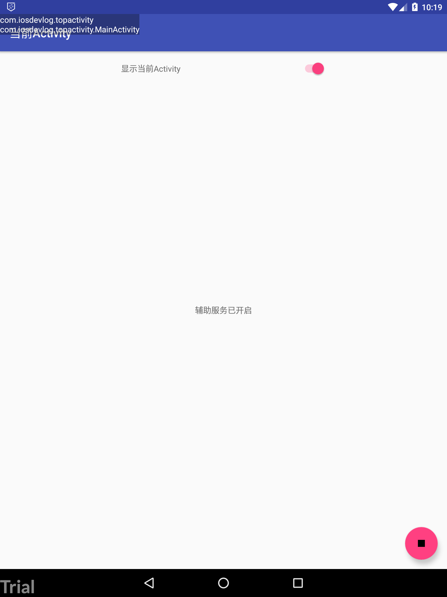

# TopActivity
---

第一个应用是 Android 的取最顶部 `Activity`。



## 分析一下需求。

1. 可以用 `AccessibilityService` 观察界面跳转
1. 从 `AccessibilityEvent` 里面取出需要的包名和类名
1. 用 `WindowManager` 添加移除 `View`

## 开发

* 创建 *Android Studio* 项目
* 添加矢量图 *play*, *stop*
* **build.gradle(Module: app)** 添加矢量支持

```
android {
    defaultConfig {
        vectorDrawables.useSupportLibrary = true
    }
}
```

* *AndroidManifest.xml* 添加顶部窗口权限

```xml
<uses-permission android:name="android.permission.SYSTEM_ALERT_WINDOW"/>
<uses-permission android:name="android.permission.SYSTEM_OVERLAY_WINDOW" />
```

* 继承 `AccessibilityService`，当窗口变化时显示或隐藏 `TopActivity`

```kotlin 
override fun onInterrupt() {
}

override fun onAccessibilityEvent(event: AccessibilityEvent?) {
    if (showTopActivityEnabled) {
        show(event!!.packageName.toString() + "\n" + event.className)
    } else {
        dismiss()
    }
}
```

* *MainActivity* 中控制是否开启显示 `TopActivity`

```kotlin
override fun onResume() {
    super.onResume()

    updateServiceStatus()
}

private fun updateServiceStatus() {
    val accessibilityManager = getSystemService(Context.ACCESSIBILITY_SERVICE) as AccessibilityManager
    val accessibilityServices = accessibilityManager.getEnabledAccessibilityServiceList(AccessibilityServiceInfo.FEEDBACK_GENERIC)
    serviceEnabled = accessibilityServices.any { it.id == packageName + "/.TopActivityAccessibilityService" }


    if (serviceEnabled) {
        service_textview.setText(R.string.services_on)
        fab.setImageResource(R.drawable.ic_stop_black_24dp)
    } else {
        service_textview.setText(R.string.services_off)
        fab.setImageResource(R.drawable.ic_play_arrow_black_24dp)
        showTopActivityEnabled = false
    }

    service_switch.isEnabled = serviceEnabled
    service_switch.isChecked = showTopActivityEnabled
}
```
